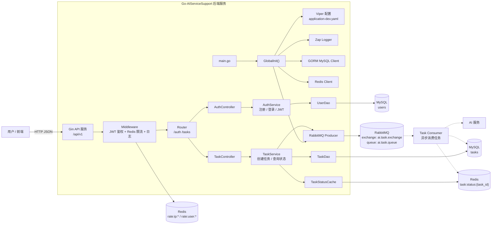

# 项目说明

## 1. 项目概述

本项目实现一个基于 Go 实现 "JWT 鉴权 + MySQL 持久化 + Redis 状态缓存与限流 + MQ 异步消费" 的 AI 任务提交与查询系统。

系统核心目标：
- 用户可以注册、登录并获取 JWT；
- 用户可以提交 AI 任务；
- 后端将任务写入 MySQL，并投递到 MQ；
- 消费端异步消费任务并调用 AI 服务；
- 前端通过轮询接口查询任务是否完成；
- Redis 用于任务完成状态缓存与请求限流；
- Zap 用于结构化日志；
- Viper 用于配置管理；
- 接口统一使用响应结构和错误码规范。


## 2. 项目架构图




## 3. 项目目录架构

```text
GO-AIServiceSupport/
├── README.md                    # 项目入口说明：目标、启动方式、核心链路
├── docs/                        # 项目设计文档
│   ├── README.md                # 文档总览
│   ├── architecture.md          # 架构说明
│   ├── business-flows.md        # 链路说明
│   ├── database-schema.md       # 数据库表、索引、约束
│   ├── api-design.md            # HTTP API 设计
│   └── roadmap-and-tech-debt.md # MVP 边界与后续技术债与迭代
├── main.go                      
├── docker-compose.yaml          # 🐳 容器编排 (MySQL + Redis + RabbitMQ)
│
├── config/                      # ⚙️ 配置管理
│   ├── application-dev.yaml     #    开发环境配置
│   ├── application-release.yaml #    生产环境配置
│   └── config.go                #    Viper + pflag 配置加载
│
├── global/                      # 🌐 全局单例
│   ├── global.go                #    DB, Redis, Config, Log
│   └── tx/                      #    事务管理抽象
│
├── initialize/                  # 🔌 初始化管线
│   ├── enter.go                 #    GlobalInit() 入口编排
│   ├── gorm.go                  #    数据库连接
│   ├── redis.go                 #    Redis 客户端
│   └── router.go                #    Gin 路由注册 + 中间件注册（先移交internal\router\router.go全权负责）
│
├── internal/                    # 🔒 业务核心 (internal 包)
│   ├── api/
│   │   ├── controller/          #    控制器层 (HTTP → DTO)
│   │   ├── request/             #    入参 DTO 定义
│   │   └── response/            #    出参 VO 定义
│   ├── model/                   #    数据模型 + GORM Hooks
│   ├── repository/dao/          #    数据访问层 (GORM 操作)
│   ├── router/                  #    路由注册
│   │   └── router.go            #    路由注册
│   └── service/                 #    业务逻辑层
│
├── common/                      # 🧰 通用工具
│   ├── e/code.go                #    错误码与消息映射
│   ├── enum/                    #    常量与枚举
│   ├── result.go                #    统一响应体
│   ├── retcode/                 #    响应封装
│   └── utils/                   #    JWT、MD5
│
├── logger/                      # 📝 日志封装 (Zap)
├── middle/                      # 🛡️ 中间件 (JWT 鉴权)
└── script/                      # 📜 数据库脚本 + 设计文档
```
